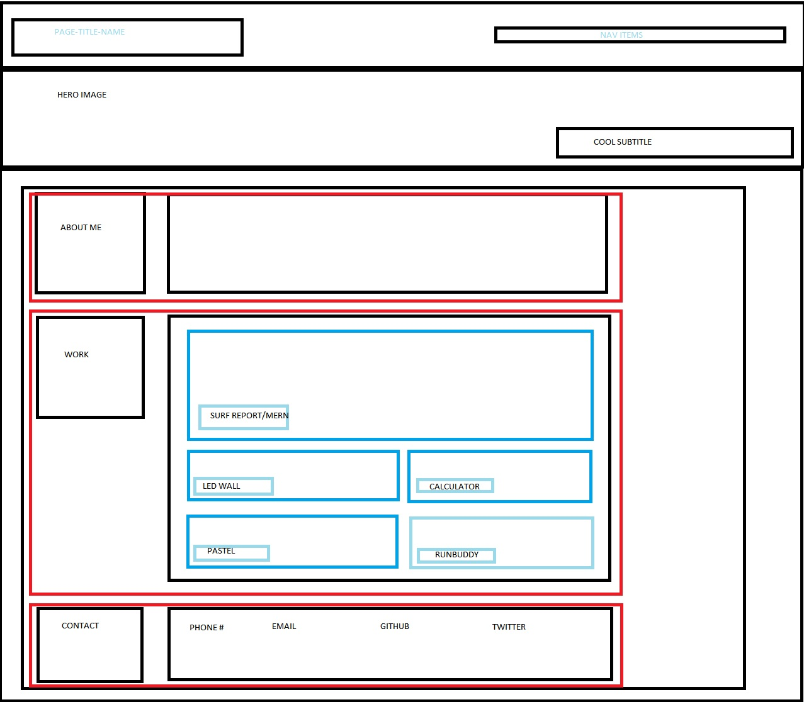
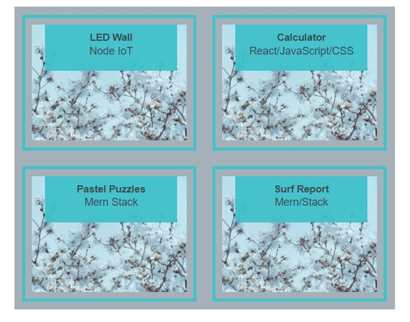

# TGU-Portfolio
The purpose of this project is to build a web application for my professional portfolio using advanced CSS techniques.

View the deployed application by [clicking this link](https://tresha-gaye.github.io/TGU-Portfolio/).

## Goals

**The goal was to create a visually appealing, accessible and responsive web application using the following advanced CSS techniques:**
- Flexbox
- media queries
- CSS variables

## Technologies

**The primary technologies used were:**
1. Visual Studio to create HTML and CSS files.
2. Git Bash command line interface for committing to repository and creating directories. 

## Approach

**Visualization**
- I started this application by creating a wireframe of the mock-up, which helped in identifying how the HTML file would be arranged and styled in CSS.

**This is the Mockup**

**This is the wireframe**

**Organization**
- Relying on the wireframe, I arranged the body of the HTML file into several sections using semantic elements: `header`, `section`, `footer`.
- The `header` section included navigation elements linked to the section headings in the body of the application.
- I incorporated my photo in the About Me section to satisfy that requirement.
- I used filler text and photos throughout, with the exception of the photo and link for the deployed Run Buddy application.
- I ended up creating additional `div`s within each section to apply styling, which greatly increased the amount of coding.

## Challenges
- The main challenge I faced was time, which was due to a slavish, over-reliance on the mock-up design, which was incredibly difficult to mimic from scratch. As a result, the functionlity suffered, and I ran out of time to incorporate working media queries to make the application responsive. Now I understand the mobile-first approach, which I will try to incorporate earlier in the process to make my applications responsive.
- Implementing the Flexbox technique was alos challenging, and so I may have overused `div`s in order to apply functional styling. 
- I did not successfully implement the 'media queries' and 'CSS variables' techniques because I spent so much time on the Flexbox technique.

**An example of boxes within boxes**

**An example of improper application of flex**

**An example of unresponsive webpage @ 768px width**

## Opportunities
- I'm looking forward to improving this application in the near future, which will require careful study and practice of the techniques that were not completely or properly deployed as required.

## Contributing

## Credits

**The following resources were used to complete this project:**
1. UCONN Coding Bootcamp's modules on HTML and CSS
2. Complete Guide to Flexbox [FreeCodeCamp.org] (https://css-tricks.com/snippets/css/a-guide-to-flexbox/)
3. Significant coding for the 'header' and 'footer' and 'media queries' was copied from and/or based on the Run-Buddy project from the UCONNN Coding Bootcamp module on CSS. 

## License
[GNU](https://opensource.org/licenses/GPL-3.0)

